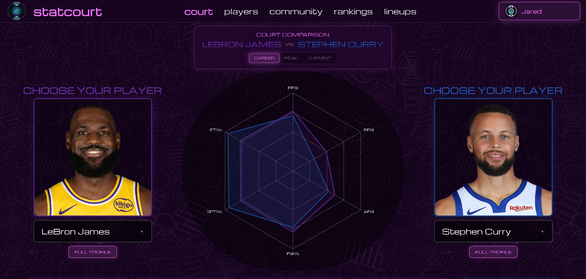

# StatCourt

StatCourt is a full-stack basketball analytics platform...

**Live App:** https://statcourt.com



The app is built with Next.js, Supabase, PostgreSQL, Redis-backed rate limiting, and a custom basketball-themed interface. It supports public player browsing, authenticated account features, public profiles, saved lineups, favorites, community discovery, and lineup scouting.

## Features

- Browse, search, and filter current and historical NBA players
- View full player profiles with ratings, traits, similar players, and lineup fits
- Compare two players across Career, Peak, and Current stat profiles
- Explore rankings by overall, scoring, shooting, playmaking, rebounding, defense, efficiency, and archetypes
- Build custom lineups with position-fit logic and drag-and-drop drafting
- Generate lineup scouting reports with archetypes, strengths, weaknesses, grades, X-Factors, and similar lineup matches
- Save, rename, load, scout, and delete lineups
- Favorite players and track recent activity
- Create public profiles with public lineups, favorite players, and basketball identity
- Follow and report public profiles
- Use Supabase Auth with email/password and Google OAuth
- Upload profile avatars through Supabase Storage
- Support protected account pages, RLS, API validation, rate limiting, and security-event logging
- Use fallback player data when Supabase player loading is disabled or unavailable

## Tech Stack

### App

- Next.js 16
- React 19
- TypeScript
- Tailwind CSS
- Recharts
- Lucide React
- dnd-kit

### Backend

- Next.js Route Handlers
- Supabase Auth
- Supabase PostgreSQL
- Supabase Storage
- Upstash Redis
- Row Level Security

### Deployment

- Vercel
- Supabase
- Resend or another SMTP provider for production auth email

### Optional Data Scripts

- Python
- nba_api
- pandas
- requests

## Project Structure

```text
statcourt/
├── app/
│   ├── api/                 # Next.js route handlers
│   ├── auth/                # Auth callback flow
│   ├── community/           # Community profile discovery
│   ├── components/          # UI, basketball logic, auth, lineups, players
│   ├── court/               # Player comparison court
│   ├── lib/                 # Auth, Supabase, rate limit, security utilities
│   ├── lineups/             # Featured, builder, and saved lineup page
│   ├── players/             # Player list and profile routes
│   ├── profile/             # Private account profile hub
│   ├── rankings/            # Player rankings and archetype rankings
│   ├── settings/            # Account, security, privacy, and preferences
│   └── u/[username]/        # Public profile pages
├── public/                  # Static assets, icons, videos, backgrounds
├── scripts/                 # SQL and optional player data scripts
├── next.config.ts
├── package.json
└── README.md
```

## Getting Started

### Requirements

- Node.js
- npm
- Git
- Supabase project
- Upstash Redis database for rate limiting

Optional, only for running player data scripts:

- Python 3
- nba_api
- pandas
- requests

### Install

```bash
git clone https://github.com/jaredmamaril/statcourt.git
cd statcourt
npm install
```

### Environment Variables

Create `.env.local` in the project root.

```env
NEXT_PUBLIC_SITE_URL=http://localhost:3000
NEXT_PUBLIC_SUPABASE_URL=
NEXT_PUBLIC_SUPABASE_ANON_KEY=
NEXT_PUBLIC_USE_SUPABASE_PLAYERS=true

SUPABASE_SERVICE_ROLE_KEY=
UPSTASH_REDIS_REST_URL=
UPSTASH_REDIS_REST_TOKEN=
SECURITY_EVENT_SALT=
```

Notes:

- `NEXT_PUBLIC_*` values are exposed to the browser.
- `SUPABASE_SERVICE_ROLE_KEY`, Redis credentials, and `SECURITY_EVENT_SALT` must stay server-only.
- Do not commit `.env.local` or private credentials.
- Keep `.env.example` updated when deployment-required variables change.

### Development

```bash
npm run dev
```

Open `http://localhost:3000`.

### Validation

```bash
npx tsc --noEmit
npm run lint
npm run build
```

The production build may need network access because `next/font` fetches Google Fonts during build.

## Deployment

StatCourt is intended to deploy on Vercel.

Before deploying:

1. Connect the GitHub repo to Vercel.
2. Add all required environment variables in Vercel.
3. Set `NEXT_PUBLIC_SITE_URL` to the production domain.
4. Configure Supabase Auth redirect URLs for the production domain.
5. Configure Google OAuth redirect URLs.
6. Configure custom SMTP in Supabase Auth, preferably with Resend.
7. Verify Supabase RLS policies are active.
8. Verify the `avatars` storage bucket policies and file limits.
9. Run `npm run build`.

Recommended production auth URLs:

```text
https://your-domain.com/auth/callback
https://your-domain.com/reset-password
```

Keep localhost redirect URLs available for development if needed.

## Supabase

StatCourt uses Supabase for:

- Authentication
- User profiles
- Public profiles
- Saved lineups
- Favorite players
- Recent players
- User activity
- Compare slots
- Follows
- Reports
- Devices
- Sign-in history
- Security events
- Player data
- Player stat profiles
- Player awards
- Avatar storage

### Security Model

- Public basketball data is read-only.
- `user_profiles` is owner-only.
- `public_profiles` exposes only public-safe profile fields.
- Public saved lineups, favorites, and follows obey profile visibility.
- Saved lineups are scoped by authenticated user ownership.
- User activity, recent players, compare slots, settings, devices, and sign-ins are owner-scoped.
- Reports are authenticated and do not expose other users' reports.
- Security events are written server-side only.
- Avatar writes are restricted to the authenticated user's storage folder.

## Authentication

Supported auth flows:

- Email/password sign up and sign in
- Password reset
- Password setup for OAuth users
- Email change flow
- Google OAuth
- Account deletion

For production, configure custom SMTP in Supabase Auth. Supabase's built-in email sender is intended for testing and has strict limits.

Recommended SMTP setup:

- Resend or another SMTP provider
- Verified sending domain
- SPF, DKIM, and DMARC records
- Sender such as `no-reply@your-domain.com`

## Security

StatCourt includes:

- Supabase RLS policies
- Server-side API authorization
- Shared input validation
- Origin checks for mutation routes
- Redis-backed rate limiting
- IDOR protection on user-owned resources
- Safe redirect validation
- Generic user-facing server errors
- Security headers and CSP
- Persistent security-event logging
- Server-only service-role usage

Never expose or commit:

- Supabase service-role keys
- Redis tokens
- database passwords
- OAuth secrets
- SMTP credentials
- security salts
- access tokens or refresh tokens

## Optional Player Data Scripts

The `scripts/` directory contains optional Python and SQL utilities for player data imports, stat profile generation, backfills, RLS setup, and security-event setup.

These scripts are not required to run the web app if the database is already populated or fallback data is used.

Before running a script:

1. Read the script.
2. Confirm required environment variables.
3. Confirm whether it writes to Supabase.
4. Run it against the intended database only.

Example Python setup:

```bash
python -m venv .venv
.venv\Scripts\activate
pip install nba_api pandas requests python-dotenv
```

Run a script from the project root:

```bash
python scripts/<script-name>.py
```

## Fallback Data

StatCourt can use local fallback player data when Supabase player loading is disabled or unavailable.

```env
NEXT_PUBLIC_USE_SUPABASE_PLAYERS=true
```

When this is not set to `true`, the app uses local fallback data for core player experiences.

## Legal and Transparency Pages

The app includes user-facing pages for:

- Privacy
- Terms
- Contact
- Data Sources
- Photo Credits

These pages explain account data, public profile visibility, analytics sources, model interpretation, image credits, and how users can contact or report issues.

## Author

**Matt Jared Mamaril**  
Computer Science student at the University of Illinois Chicago

- [LinkedIn](https://linkedin.com/in/mattjaredmamaril)
- [GitHub](https://github.com/jaredmamaril)

## Disclaimer

StatCourt is an independent basketball analytics project.

It is not affiliated with, endorsed by, or sponsored by the NBA, its teams, or its players.

Basketball data, team names, logos, player imagery, trademarks, and other third-party assets belong to their respective owners.
